# Ranjit Rajbhar — GitHub Profile

<picture>
  <source media="(prefers-color-scheme: dark)" srcset="./dark.svg">
  <source media="(prefers-color-scheme: light)" srcset="./light.svg">
  
</picture>

## About

Sr. Support Engineer focused on IT support, system administration, networking, Active Directory, Windows Server and day-to-day IT operations.

## Core Focus

- IT Support & IT Operations
- Windows & Windows Server administration
- Active Directory, Group Policy and user administration
- LAN/WAN, DNS, DHCP and endpoint troubleshooting
- Firewall and network support
- ITSM / SLA-driven support
- PowerShell and support automation

## Selected Projects

### IT Support Toolkit
A browser-based collection of practical IT support utilities and Windows troubleshooting workflows.

### IT System Report Automation
A PowerShell-based reporting workflow for collecting endpoint and system information for IT support use.

### My Life Map / Life-Story
A GitHub Pages project built with HTML, CSS and JavaScript.

## Technology

`Windows` · `Windows Server` · `Active Directory` · `GPO` · `Networking` · `CCNA` · `Sophos Firewall` · `PowerShell` · `HTML` · `CSS` · `JavaScript` · `ITSM`

## Certifications & Learning

- Windows Server 2022 Essential Training
- CCNA v1.1 (200-301) learning

## Animated GitHub Activity

### <code>ranjit@github ~ $ ./contributions.sh</code>

  

<table>
  <tr>
    <td valign="top">
      
    </td>
  </tr>
</table>

The contribution calendar is generated from GitHub's public contribution calendar and refreshed automatically with GitHub Actions.

## GitHub

Explore the repositories and projects on my GitHub profile:

- https://github.com/Ranjit-copilot

---

  Technical support · systems · networking · automation

# Premium Engineering Profile

  

  

---

## Engineering Profile

I am a **Sr. Support Engineer** focused on enterprise IT operations, infrastructure support, endpoint management and practical automation. My work combines Windows administration, Active Directory, networking, ITSM, endpoint security and PowerShell-based workflows to make technical support more reliable and repeatable.

### Product Engineering Mindset

> **Understand the problem → automate repetitive work → document the solution → make it scalable.**

### Open To

<code>IT Operations</code> <code>L2 Support</code> <code>System Administration</code> <code>Infrastructure</code> <code>IT Automation</code> <code>Technical Support Engineering</code>

---

# Tech Stack

### Languages

### Frontend

### Backend & Databases

### Cloud, DevOps & Tooling

---

# AI / ML Expertise

| Domain | Proficiency | Details |
|---|---|---|
| AI-assisted IT Support | <code>████████░░</code> | Exploring AI-driven troubleshooting and support workflows |
| IT Automation | <code>█████████░</code> | PowerShell, Windows administration and repeatable support workflows |
| Intelligent Knowledge Systems | <code>███████░░░</code> | Structured technical knowledge and support workflows |
| AI + Infrastructure | <code>███████░░░</code> | Exploring practical AI applications for enterprise IT operations |
| Developer Automation | <code>████████░░</code> | Automated tooling and workflow-oriented utilities |

---

# Featured Projects

<b>🛠️ IT Support Toolkit</b>

A browser-based collection of practical IT support utilities and Windows troubleshooting workflows.

| Stack | Scale | Performance | Security | Impact | Repository |
|---|---|---|---|---|---|
| HTML • CSS • JavaScript | IT Support | Lightweight browser UI | Admin-aware workflows | Centralized support utilities | [GitHub](https://github.com/Ranjit-copilot) |

<b>⚙️ Windows Recovery Repair Toolkit</b>

A workflow-oriented Windows repair toolkit covering system integrity, networking, diagnostics and recovery operations.

| Stack | Scale | Performance | Security | Impact | Repository |
|---|---|---|---|---|---|
| CMD • PowerShell • HTML • CSS • JavaScript | Endpoint Support | Native Windows diagnostics | Administrator awareness | Standardized troubleshooting | [GitHub](https://github.com/Ranjit-copilot) |

**Operations:** SFC • DISM • CHKDSK • DNS Flush • Winsock Reset • TCP/IP Reset • Battery Diagnostics • System Information • Network Diagnostics

<b>📊 IT System Report Automation</b>

A PowerShell-based endpoint reporting workflow for collecting hardware, operating-system and network information for IT support.

| Stack | Scale | Performance | Security | Impact | Repository |
|---|---|---|---|---|---|
| PowerShell • Batch • Windows Diagnostics | Enterprise Endpoint Support | Automated collection | Local administrative workflow | Reduces manual reporting | [GitHub](https://github.com/Ranjit-copilot) |

<b>🔐 Active Directory Administration Automation</b>

Automation concepts for common on-premises Active Directory administration tasks, including user provisioning, OU-based workflows and Group Policy operations.

| Stack | Scale | Performance | Security | Impact | Repository |
|---|---|---|---|---|---|
| PowerShell • Active Directory • Windows Server | Enterprise Domain | Repeatable workflows | AD/GPO administration | Reduces repetitive operations | [GitHub](https://github.com/Ranjit-copilot) |

<b>🌐 My Life Map / Life-Story</b>

An interactive GitHub Pages experience built with HTML, CSS and JavaScript.

| Stack | Scale | Performance | Security | Impact | Live Project |
|---|---|---|---|---|---|
| HTML • CSS • JavaScript | Interactive Web | Static GitHub Pages | Static frontend | Interactive storytelling | [Open Project](https://ranjit-copilot.github.io/Life-Story/) |

---

# Experience

## Sr. Support Engineer — Keva Flavours Pvt Ltd.
### Deployed by Om Sai Corporation

**March 2024 — Present**

Supporting enterprise IT operations across a **400+ device environment**, spanning endpoint support, infrastructure administration, networking, security and ITSM processes.

- L1/L2 technical support for enterprise users and endpoints
- Windows desktop and operating-system troubleshooting
- Active Directory user provisioning and administration
- Group Policy administration
- Windows Server administration
- LAN/WAN troubleshooting
- DNS and DHCP troubleshooting
- IP conflict resolution
- Printer and shared-drive troubleshooting
- Sophos Firewall administration and support
- Patch management and endpoint protection
- Hardware diagnostics and replacement coordination
- IT asset tagging, allocation, tracking and disposal
- ITSM ticket handling and SLA-focused support
- Maintaining audit-ready IT asset records

**Skills:** <code>Windows</code> <code>Active Directory</code> <code>GPO</code> <code>Windows Server</code> <code>Networking</code> <code>DNS</code> <code>DHCP</code> <code>Sophos Firewall</code> <code>ITSM</code> <code>SLA</code> <code>PowerShell</code> <code>Asset Management</code>

---

# Achievements

| Recognition | Details |
|---|---|
| Enterprise IT Support | Supported a 400+ device environment |
| Asset Management | Maintained audit-ready asset records |
| Automation | Developed practical automation concepts for repetitive IT workflows |
| Infrastructure | Hands-on Active Directory, Windows Server and Group Policy administration |
| Networking | Troubleshooting across LAN/WAN, DNS, DHCP and endpoint connectivity |
| Security | Endpoint protection, patching and Sophos Firewall support |

---

# Certifications & Learning

### Microsoft

### Cisco

### Current Learning

---

# Coding Profiles

---

# GitHub Analytics

 

---

# GitHub Trophies

---

# Contribution Activity

---

# Contribution Snake

---

# Current Focus

\`\`\`yaml
profile:
  name: "Ranjit Rajbhar"
  role: "Sr. Support Engineer"
  location: "Mumbai, India"

Learning:
  - CCNA
  - Azure
  - Microsoft 365
  - Entra ID
  - Intune
  - ServiceNow
  - PowerShell
  - IT Automation

Building:
  - IT Support Automation Tools
  - Windows Recovery Utilities
  - System Reporting Automation
  - Practical Infrastructure Workflows
  - Developer Portfolio Systems

Exploring:
  - AI-assisted IT Support
  - Intelligent Automation
  - Cloud Administration
  - Infrastructure Engineering
  - Full-Stack Internal Tools

Open To:
  - IT Operations
  - L2 Support
  - System Administration
  - Infrastructure Engineering
  - IT Automation
\`\`\`

---

# Connect

---

**Technical Ranjit • IT Operations • Infrastructure • Automation**

